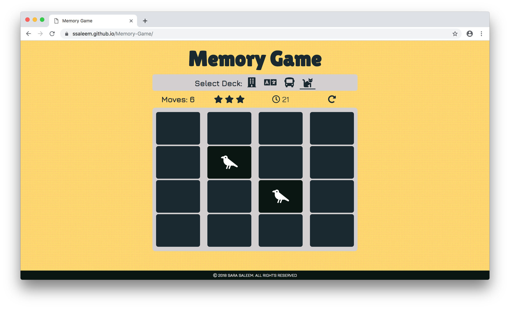

# Memory Game
A responsive, feature packed memory game web application.

## About the Game
### How to Play
You task is to match pairs of cards. Playing is very simple - you turn over one card and then try to find a matching card. You can choose from various deck options.

### Timer 
A timer at the top of the deck shows the time elapsed (in seconds) since the beginning of the game. _Web storage API_ is used to store fastest game completion time locally within the user's browser.

### Ratings
Ratings are assigned based on the moves used for winning.

|Moves | Rating(stars) |
-------| --------------
|< 12  | 3             |
|< 18  | 2             |
|> 18  | 1             |

## Built with
- [HTML5 LocalStorage](https://developer.mozilla.org/en-US/docs/Web/API/Storage/LocalStorage) - Web storage for web applications to store data locally within the user's browser with no expiration date.
- [Window setInterval() Method](https://www.w3schools.com/jsref/met_win_setinterval.asp) - Repeats a given function at every given time-interval
- [CSS Flexbox](https://www.w3schools.com/css/css3_flexbox.asp) -  CSS layout module to design flexible responsive layout structure without using float or positioning.
- [CSS Media Queries](https://www.w3schools.com/css/css3_mediaqueries.asp) - A popular technique to deliver a tailored style sheet to desktops, laptops, tablets, and mobile phones by defining different style rules for different media types.
- [Google Fonts](https://fonts.google.com/) - A library of 900 libre licensed fonts.
- [FontAwesome Icons](https://fontawesome.com/icons?d=gallery) - A font and icon toolkit.

## Live Version
Check out the live version of this app [here](https://ssaleem.github.io/Memory-Game/).
